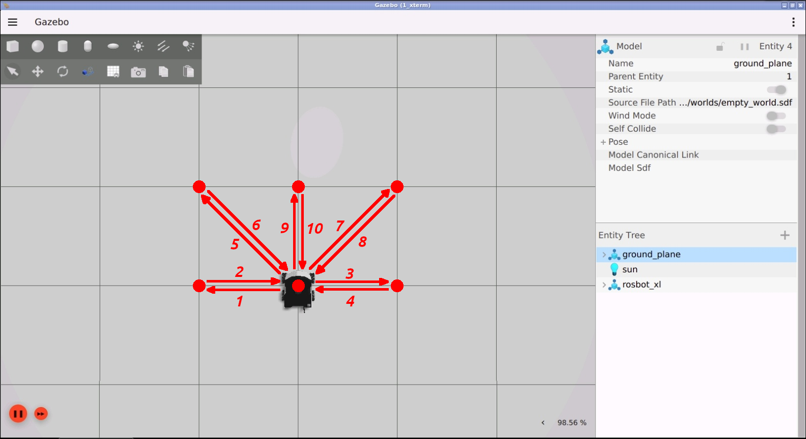
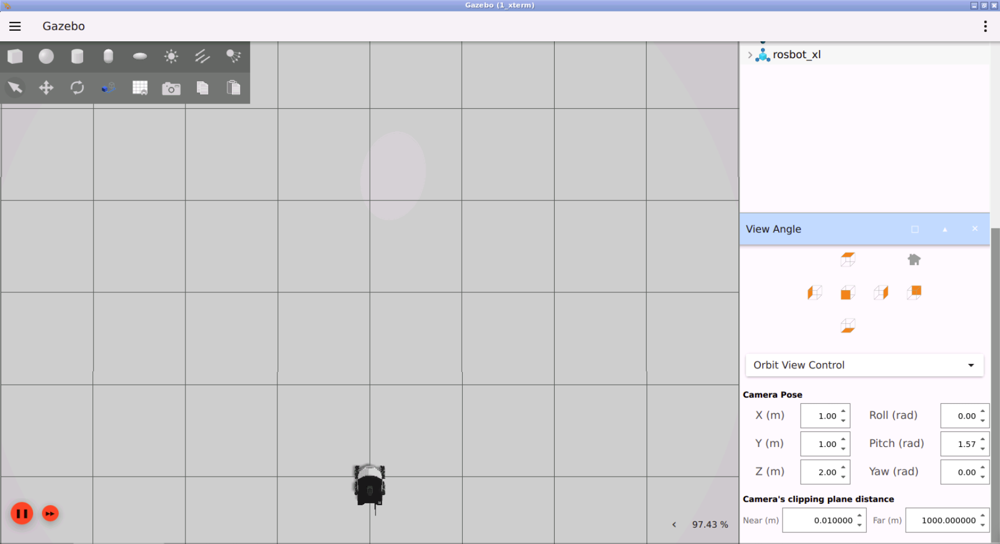
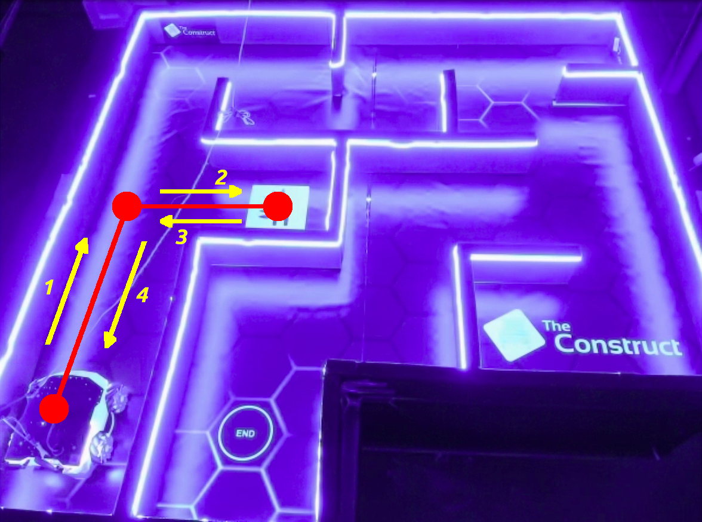

# Checkpoint 17 — Distance Controller

ROS 2 C++ **PID position controller** for the **Husarion ROSBot XL** (4-wheel mecanum / holonomic). The node drives the robot through a chain of relative `(dx, dy)` waypoints by closing the loop on the **Euclidean distance** to each goal and projecting the PID output along the unit direction vector to produce body-frame `v_x` / `v_y`. Subscribes to the EKF-fused odometry, publishes `geometry_msgs/Twist` on `/cmd_vel`, and works against both the Gazebo simulation and the real CyberWorld ROSBot XL — the waypoint list is selected from a **scene number** passed as a CLI argument.

<p align="center">
  
</p>

## How It Works

<p align="center">
  
</p>

### Control Loop

1. A single-node executable `distance_controller` subscribes to `/odometry/filtered` (`nav_msgs/Odometry`) and publishes `geometry_msgs/Twist` on `/cmd_vel`
2. On construction it calls `select_waypoints(scene_number)` — `1` loads the sim waypoint list, `2` loads the CyberWorld list
3. `run()` blocks until a subscriber is connected, then iterates over the `[dx, dy, _]` motion list, accumulating each `(dx, dy)` into absolute goals `(goal_x, goal_y)`
4. Per iteration (`25 ms` loop, timed with `std::chrono::steady_clock`):
   - Radial error `e = (goal_x - x, goal_y - y)`, scalar `dist = hypot(e)`
   - PID on `dist`: `v = Kp·dist + Ki·∫dist·dt + Kd·Δdist/dt`
   - Clamps: integral wind-up `±1.0`, linear command `±0.4 m/s`
   - Unit direction `(ux, uy) = e / dist`, body-frame command `(v_x, v_y) = v · (ux, uy)`, `ω_z = 0`
5. Exits the per-waypoint loop when `dist ≤ 0.01 m`; emits a 0.5 s zero-twist burst (`stop()`) between segments before moving to the next

### PID Configuration

| Gain | Value |
|------|-------|
| `Kp` | `0.5`  |
| `Ki` | `0.05` |
| `Kd` | `0.1`  |
| Integral clamp `I_MAX` | `1.0`  |
| Max linear speed `V_MAX` | `0.4 m/s` |
| Position tolerance `pos_tol` | `0.01 m` |

## Waypoint Scenes

Both scenes are relative `(dx, dy, _)` triplets in the absolute odom frame:

### Scene 1 — Simulation (`scene_number = 1`, 10 waypoints)

```
(0, 1), (0,-1), (0,-1), (0, 1),
(1, 1), (-1,-1), (1,-1), (-1, 1),
(1, 0), (-1, 0)
```

### Scene 2 — CyberWorld (`scene_number = 2`, 4 waypoints)

```
(0.88, 0.0), (0.0, -0.60), (0.0, 0.60), (-0.88, 0.0)
```

## Real Robot Deployment (CyberWorld)

<p align="center">
  
</p>

The same executable runs **unmodified** on the real Husarion ROSBot XL in The Construct's **CyberWorld** lab — only the scene number changes. The `scene_number = 2` path is intentionally short (`4` waypoints, `~0.88 m × 0.60 m` rectangle) to fit the real arena and stay inside the laser-obstructed walls:

1. The ROSBot XL real-robot stack (`rosbot_xl_ros` + its EKF + wheel controllers) is already running on the physical robot; `/odometry/filtered` is served over the CyberWorld connection
2. The `distance_controller` node is launched locally with `scene_number = 2`:

   ```bash
   ros2 run distance_controller distance_controller 2
   ```
3. Closed-loop tracking uses the **same EKF-fused odometry topic** (`/odometry/filtered`) that the sim subscribes to — the controller is feedback-source agnostic
4. The real-robot trace validates:
   - PID gains tuned on the holonomic platform transfer 1:1 from sim to hardware
   - Integral wind-up clamp (`±1.0`) prevents overshoot on the longer `0.88 m` first segment
   - `pos_tol = 0.01 m` is achievable on the real robot without chattering because the `V_MAX = 0.4 m/s` cap + 25 ms control loop damps the approach

### Sim ↔ real parity

| Concern | Simulation (scene 1) | Real CyberWorld (scene 2) |
|---|---|---|
| Feedback topic | `/odometry/filtered` | `/odometry/filtered` |
| Waypoint count | 10 | 4 |
| Max segment length | `√2 m` | `0.88 m` |
| PID gains | `Kp=0.5, Ki=0.05, Kd=0.1` | `Kp=0.5, Ki=0.05, Kd=0.1` (unchanged) |
| Tolerance | `0.01 m` | `0.01 m` |
| Clock | sim time | wall clock |

## ROS 2 Interface

| Name | Type | Description |
|---|---|---|
| `/odometry/filtered` | `nav_msgs/Odometry` (sub) | EKF-fused odometry consumed as feedback |
| `/rosbot_xl_base_controller/odom` | `nav_msgs/Odometry` | Raw wheel odometry (alternate, commented in source) |
| `/cmd_vel` | `geometry_msgs/Twist` (pub) | Body-frame command (`linear.x`, `linear.y`, `angular.z = 0`) |

## Project Structure

```
distance_controller/
├── src/
│   └── distance_controller.cpp
├── include/
├── media/
├── CMakeLists.txt
└── package.xml
```

## How to Use

### Prerequisites

- ROS 2 Humble
- Gazebo (bundled with the `rosbot_xl_gazebo` simulation)
- `eigen3`, `tf2`, `nav_msgs`, `geometry_msgs`
- `rosbot_xl_ros` stack in the same workspace (description + controllers + EKF)

### Build

```bash
cd ~/ros2_ws
colcon build --packages-select distance_controller --symlink-install
source install/setup.bash
```

### Simulation

```bash
# Terminal 1 — ROSBot XL in Gazebo
ros2 launch rosbot_xl_gazebo simulation.launch.py

# Terminal 2 — PID distance controller (scene 1 = simulation waypoint set)
ros2 run distance_controller distance_controller 1
```

### Real robot (CyberWorld)

```bash
ros2 run distance_controller distance_controller 2
```

### Sanity checks

```bash
ros2 topic echo /cmd_vel
ros2 topic echo /odometry/filtered
```

## Key Concepts Covered

- **PID on scalar distance**: integral wind-up clamp, derivative from sample-to-sample delta
- **Vector projection**: scalar PID output split into `(v_x, v_y)` via the unit vector toward the goal (holonomic platform — no yaw correction needed)
- **Real-time timing**: `std::chrono::steady_clock` for `dt`, 25 ms control period
- **Scene switching via CLI**: same executable drives sim and real robot by selecting a waypoint table
- **Feedback source**: EKF-fused odometry (`robot_localization`) vs. raw `rosbot_xl_base_controller/odom`

## Technologies

- ROS 2 Humble
- C++ 17 (`rclcpp`, `nav_msgs`, `geometry_msgs`, `tf2`)
- Eigen 3
- Husarion ROSBot XL (4-wheel mecanum) in Gazebo Sim + CyberWorld
